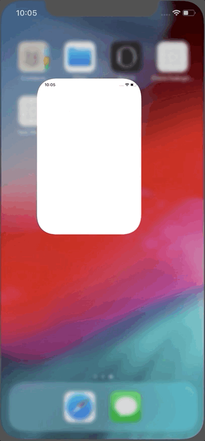

# iCharts
> A simple and customizable radar chart for iOS.


## How to install ?

1) Paste the iCharts.framework to the root of your project.

2) Add iCharts.framework in the general settings.


## How to use it ?

1) Import iCharts

```swift
import iCharts
```

2) Create the view by adding an UIView in your Storyboard.

3) Select UIRadarChart in the identity inspector.

4) Setup the UIRadarChart.
```swift
class ViewController: UIViewController {

    @IBOutlet weak var radarChart: UIRadarChart!

    override func viewDidLoad() {
        super.viewDidLoad()
        let radarChartDataValues1: RadarChartDataValues = RadarChartDataValues(values: [28, 20, 50, 46, 82, 84], color: UIColor.cyan)
        let radarChartDataValues2: RadarChartDataValues = RadarChartDataValues(values: [38, 76, 67, 82, 48, 92], color: UIColor.orange)
        let radarChartData: RadarChartData = RadarChartData(values: [radarChartDataValues2, radarChartDataValues1],
                                                            labels: ["AUG", "SEP", "OCT", "NOV", "DEC", "JAN"])
        self.radarChart.data = radarChartData
        self.radarChart.drawingStyle = .circles
        self.radarChart.animation = true
        self.radarChart.draw()
    }
}
```

## Features

### UIRadarChart




